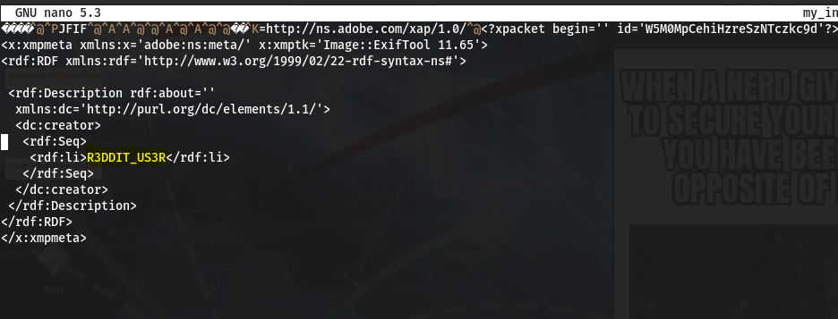

**SNOW SNOW**

Using stegsnow -C command I tried to decode the flag but what I got from that is 

So I tried to decode ntio{eP1B35x4K3\_aB3O0\_q5\_K00t} using an online too .i.e. <https://www.dcode.fr/caesar-cipher>

And got the required flag

Flag: flag{wH1T35p4C3\_sT3G0\_i5\_C00l}

**DETAILED VIEW**

I tried to extract the text from the png file using strings command .

And I got a link! When I go to that link I get a encoded text

Now , I tried to decode using the online tool <https://www.base64decode.org/>

And got the flag as **flag{M15sI0N\_aCc0MPL15h3D}**

**Back to San Andreas**

In the task, I got a jpg file. So I tried to retrieve if there is any hidden file. So, for that ive used jsteg. 

Then I got a link and we’ll get the flag there.

**Flag: inctfj{gr0ve\_5treet\_f0r\_l1fe}**

**SECURITY 101**

When I trued to open the jpg using a text editor I got a text in that “R3DDIT\_US3R”

So I tried to unzip the zip file using that password . and got a secure.jpg which contains the flag

**Flag: inctfj{1ts\_4ll\_f1ne\_tru5t\_m3}**

**THE OFFICE TROUBLE 1**

As a task file, I got a zip file. When I tried to unzip , it asks for password. 

So I tried to hack the password using fcrackzip

And then got the password. Using that I unzipped the zip file and got a file the\_office.jpg which contains the flag

**Flag: inctfj{dw1ght\_1s\_cr4zy\_bu7\_awes0me}**

**My-First-Stegnography**

I used to steghide to retrieve the flag

First I retrieved the passphrase for blueprint0.jpg from blur print.jpg

From there I got password.txt containing the passphrase for blueprint0.jpg.using that I extracted the hidden file from blueprint0.jpg containing the flag

**inctfj{w3\_4r3\_pl4nt1ng\_4\_b0mb}**

**Always Has Been**

Initially I tried to retrieve the flag using strings command but was unsuccessful . so I tried using stegsolve .

**inctfj{th3\_fl4g\_wa5\_liter4lly\_ins1de\_4\_m3me}**

**CON-THE-CAT**

Got the flag by extracting the hidden files using dd if=sus.png of=flag1.jpeg skip=7821 bs=1. 

**Flag: inctfj{y0u\_c4nt\_s33\_m3!!}**

**MAGIIN-DIGITs**

When I tried pngcheck I came to know that some of the chunks in the file are wrong. So I corrected it and opened the image containing flag

**Flag: flag{Chunks\_4r3\_1mpor74n7\_f0r\_1mage5}**

**YOU CANT SEE ME**

The chall file which I got was a corrupted png image. We got the flag after resolving all the errors.

**Flag: inctfj{WH4t\_ar3\_pNgCHUnkS?}**

**JAY-CHOT**

In this chall I got a jpg file where magic numbers were not in order. I tried to edit it using hexeditor and got the flag.

**Flag:** **flag{a4aa04741a8d3a952a7ec88457991b97}** 

**ANGRY STEVE**

In this challenge we were given a jpg file .

To retrieve the flag I used strings command . This was one of the challenge which I remember doing in inctfj xD

**Flag: inctfj{string5\_m4keth\_fl4gs}**

**MYSTERIOUS FILE**

It gave a png file with txt extension. So when I tried to open the png file , flag was there

**Flag: inctfj{3xt3ns10ns\_m1sl3ad}**

**CORRUPTED FILE**

When I used strings command to the challenge file, I got a base64 encoded text. I got the flag by decoding it.

**Flag : flag{9e360084196a092a15c5c44b54934bfc}**

**NOICE**

As the challenge file I got a audio file with .wav extension. So I opened that in audacity and in the spectrogramic form I got the flag.

**Flag: inctfj{y0u\_b3tt3r\_l00k\_cl0s3ly}**

**THE OFFICE TROUBLE II**

Here I got a password encrypted pdf file . decripted the password using pdfcrack.

And by using the password as **fear420** I opened the pdf file which contains the password

**Flag: inctfj{ass1stant\_t0\_th3\_regi0nal\_man4ger}**

**S3CR3T**

The clall file was a audio file… I tried to decode the flag using an online tool which decodes morsecode.

**Flag: inctfj{M0RS3C0D3I5C001}**

**MARIANA\_TRENCH\_DEEP**

in one of the challl file I got brainfuck/ook texts…. I decoded it using an online tool ( <https://www.splitbrain.org/services/ook> )and got the flag

**Flag: inctfj{l4ngu4g35\_d0nt\_m4k3\_s3ns3}**
