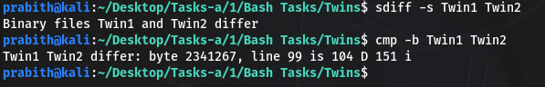

**nE\_challenge1.jpg**

Used exiftool to retrieve the flag

 

Flag: **inctf{y0u\_l34rn3d\_3xift00l}**

**SS\_challenge1**

I tried to retrieve the flag using stegsolve

Flag: **pctf{st3gs0lv3\_1s\_u53ful}**

**Z\_challenge**

In this , I’ve scanned the barcode using zbar tools ,zbarimg.

Flag: **flag{B4r\_c0de\_scanned}**

**FS\_challenge.png**

Png image was corrupted . I corrected it using hexedit and got the flag from the corrected file

Flag: **flag{pro7ec7\_y0ur\_Chunk5\_Dud3}**

**B\_challenge1**

I’ve extracted the zip file from the given b\_chellenge1.png using binwalk. And when I tried using strings command I got base64 encoded flag.

` `Decoded it using online tool and got the flag

Flag: **flag{w3ll\_7ry\_n0\_flag\_but\_us3ful}**

**S\_challenge.png**

Tried to use strings command and got the base64 encoded flag . 

Decoded it using online tool and got the real flag

Flag: **flag{5trings\_1S\_in7er3s7inG}**

**SH\_challenge1.jpg**

Decoded the base64 flag using online tool to get the real flag

Flag: **c0unt3r-str1k3-is-f4n**

**Find-flags-in-me**

Got the first flag using strings

Flag1: **inctf{y4yy!!!\_found\_th3\_fir5t\_fl4g}**

Flag2: **InCtF{G00d\_jobb!!This\_is\_the\_2nd\_on3}**

Flag3: inctf{th1s\_1s\_th3\_l4st\_0ne}

**Twins**

We were given two files Twin1 & Twin2. Both looked similar in appearance and was asked to check the difference .

So used raadiff to get the differences 

Flag: **inctf{y0u\_Got\_m3}**

Revers.me

There was some unreadable text inside revers.me. so I tried to run strings command and got the reversed form of the flag

Reversed it and got the flag

Flag: Inctf{Y0u\_ar3\_g00d\_4t\_rev3rs1ng\_1\_gu3ss}

